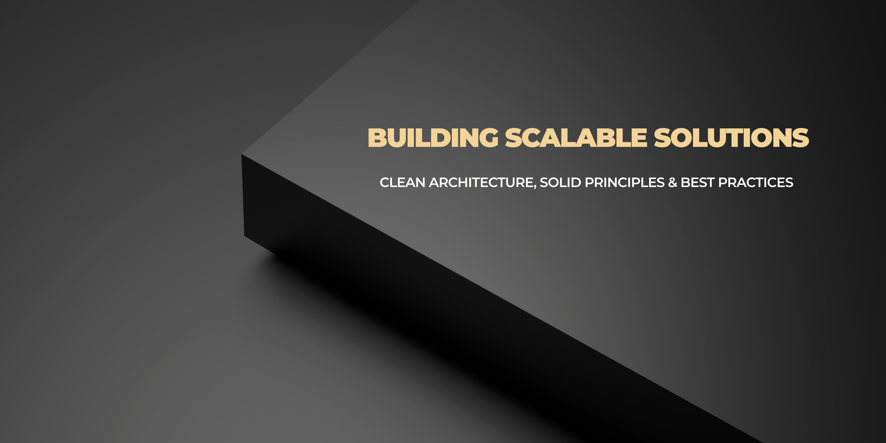

  

## Software Engineer | Backend Architectures & AI Systems

Software Engineer specializing in the design of scalable, high-performance systems under **Clean Architecture** and **Hexagonal Architecture** paradigms. My professional focus centers on orchestrating robust solutions that align business requirements with technical excellence, strategically integrating **Generative AI** capabilities to optimize critical operational processes.

### Engineering Pillars & Technical Rigor

* **Architecture & System Design:** Implementation of architectures based on **decoupled layers** to ensure a strict **separation of concerns**. I strategically select the technical approach—including **Hexagonal Architecture** fundamentals—based on system requirements and complexity, prioritizing modularity and business logic isolation to ensure scalable and testable systems.
* **Security & Compliance:** Development grounded in **official documentation** and industry standards. I apply a **Security-by-Design** approach, prioritizing systemic resilience and protection against attack vectors from the initial design phase.
* **Generative AI & Data Ecosystems:** Specialization in orchestrating **RAG** (Retrieval-Augmented Generation) architectures and managing vector databases (**Milvus**) for the efficient processing of technical information flows.
* **Quality & SDLC:** Commitment to delivering software free of technical debt through **Automated Testing** strategies (Unit & Integration) and Continuous Integration (CI/CD) processes to ensure production-grade stability.

### Core Technologies & Engineering Stack

| Domain | Technologies & Practices |
| :--- | :--- |
| **Software Architecture** | Clean Architecture, Hexagonal Architecture, SOLID Principles, Clean Code, Design Patterns |
| **Backend & AI Systems** | Java (Spring Boot), Python, LangChain, RAG Architectures, Generative AI, Large Language Models (LLMs), Vector Embeddings |
| **Frontend & Performance** | TypeScript, Angular, React |
| **Data & Persistence** | PostgreSQL, MongoDB, Milvus (Vector DB) |
| **Infrastructure & CI/CD** | Docker, Git/GitLab, GitLab CI/CD, Maven |
| **Testing & Documentation** | JUnit, Mockito, Pytest, Swagger / OpenAPI |
| **Methodologies** | Agile (Scrum) |

### Let's Connect

I am always open to discussing system architecture, backend engineering, and generative AI integration.

* **LinkedIn:** [santiago-dorado-sánchez](https://www.linkedin.com/in/santiago-dorado-sánchez-6933583b3)
* **Email:** [sanchez.dorado@outlook.com](mailto:sanchez.dorado@outlook.com)

> *"Code is read far more often than it is written. Designing decoupled, secure, and testable systems is not an option; it is the foundation of professional engineering."*